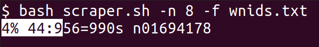

This is a simple Bash script to scrape images from ImageNet.

### Usage

The script must be given a list of classes for which you require images to be downloaded.
Here each class must be specified by its WordNet ID: for example, 'n01440764' is the WordNet ID for the class 'tench', and 'n01443537' is the WordNet ID for the class 'goldfish'.

These classes may be specified as command-line arguments:
```bash
$ ./scraper.sh 'n01440764' 'n01443537'
```
but as the number of classes grows, this may become very cumbersome.
In such a case, you can list all the WordNet IDs in a file, separated by newlines, and specify this file to the script as follows:
```bash
$ ./scraper.sh < 'wnids_file.txt'
```
By default, 10 images are downloaded per class specified.
You can change this using the `-n` option:
```bash
$ ./scraper.sh -n '50' < 'wnids_file.txt'
```
The downloaded images are stored in directories (inside the current directory) corresponding to each class.
For example, for 'tench' and 'goldfish', the directory structure will look like this after running the script:
```
n01440764/
	1345140957_2c46ddc413.jpg
	2475423937_7d2c7abb01.jpg
	...
n01443537/
	2189406982_531dff94aa.jpg
	2547084984_d60cde1e13.jpg
	...
```
A snapshot of this script while running is shown below:



The output is a progress bar (courtesy of GNU Parallel, see the [requirements section](#requirements) below).
This progress bar indicates that downloading has completed for 4% of the classes; for 44 of them, downloading is in progress/has completed and for the remaining 956, downloading is yet to start.
'990s' is the ETA, i.e. a loose estimate of how much more time the script will take.

### Timing

The script parallelizes class-wise downloads to save on time.
On a 4-core CPU with a fairly good Internet connection, given 1000 classes and 8 images to download per class, it took about 26 minutes.

### Requirements

You will need Wget and GNU Parallel installed.
Citation for GNU Parallel:

> O. Tange (2011): GNU Parallel - The Command-Line Power Tool, ;login: The USENIX Magazine, February 2011:42-47.

Typically these can be installed using your package manager.
For example, on Debian systems
```
$ sudo apt install wget parallel
```
and on Arch systems:
```
$ sudo pacman -S wget parallel
```
As you may have probably guessed, Wget does the actual downloading, while Parallel is responsible for parallelizing the class-wise downloads.

### Note

It turns out that this script will not download the _exact_ same number of images you specify using the `-n` argument.
The number of images downloaded per class will be _close_ to this number but will show some variation.
This has to do with the fact that many images in ImageNet are no longer available, so when you specify a certain number of images for download, a few among them turn out to be missing at runtime.
See [this section](#details) for more details.

### WordNet IDs

If you are interested in the 1000 classes used in the ImageNet challenges from 2012-2017, you can use the file `wnids_1000.txt` provided, which contains the WordNet IDs of these classes along with a short label describing each class.

You can use this file to lookup individual IDs corresponding to the classes you are interested in, or to download images for all of the 1000 classes.
In the latter case, note that you must not pass this file directly to the script (don't do `-f 'wnids_1000.txt'`), or it will fail - instead, you should do something like this:
```bash
$ ./scraper.sh < <(cut -d ',' -f '2' < 'wnids_1000.txt')
```
which will (temporarily) remove the labels in the file and retain only the WordNet IDs.

### Script Working

Why do you need a script to scrape images from ImageNet?
As of August 2021, if you need to access the "full" ImageNet, you need to [submit a request](https://image-net.org/download.php).
Otherwise, if you need the subset of ImageNet comprising 1000 classes that was used in the ImageNet challenges from 2012-2017, that dataset is available on [Kaggle](https://www.kaggle.com/c/imagenet-object-localization-challenge/overview/description): however, it is over 150 GB in size.

As of August 2021, the link
```
https://www.image-net.org/api/imagenet.synset.geturls?wnid=<wnid>
```
yields a list of image URLs corresponding to the class whose WordNet ID `<wnid>` you have specified.
(Note that this way of accessing ImageNet doesn't seem to be officially endorsed, so it may change in future.)
This script queries this link and follows the URLs listed to download images.

These links are old - they were collected in 2011 - so it turns out that many of them are broken.
A large bulk of URLs are from Flickr, and they are often more reliable than the others,<sup>[1](#footnote1)</sup> so this script uses only the Flickr URLs.
But even the Flickr URLs have problems, and sometimes result in 404 and other errors; my observation is that on average 25% of the Flickr URLs turn out to be broken.
Hence, the script adopts the following workaround: it boosts the number of images set for download by a factor of 1.33.
In other words, if you specify N images to be downloaded per class, it actually attempts to download 1.33 x N number of images.
As a result, after subtracting the 25% of URLs that turn out to be broken, the number of images actually downloaded settles to a number close to N.

### Privacy

As a last note, please keep in mind that ImageNet is facing several [privacy issues](https://image-net.org/update-mar-11-2021.php), so any data scraped from it must be used responsibly.

### References

<a name='footnote1'>1.</a> Frolovs, Martin. Downloading the ImageNet. Link: <https://towardsdatascience.com/how-to-scrape-the-imagenet-f309e02de1f4>
